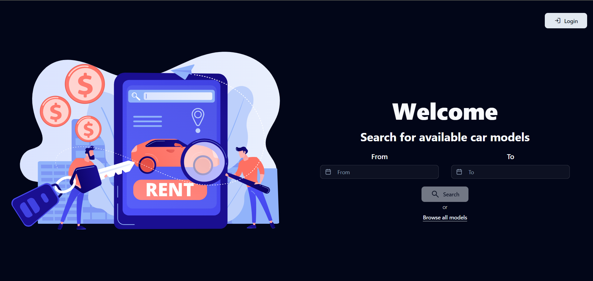
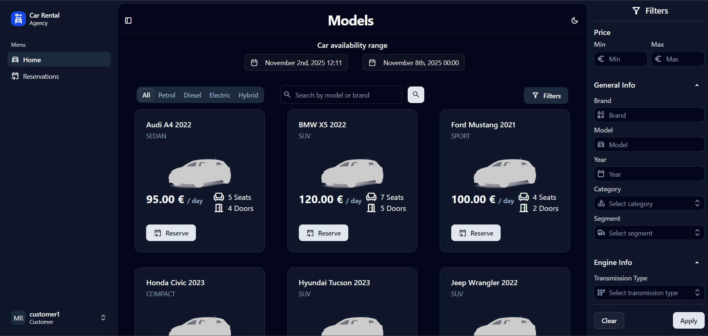
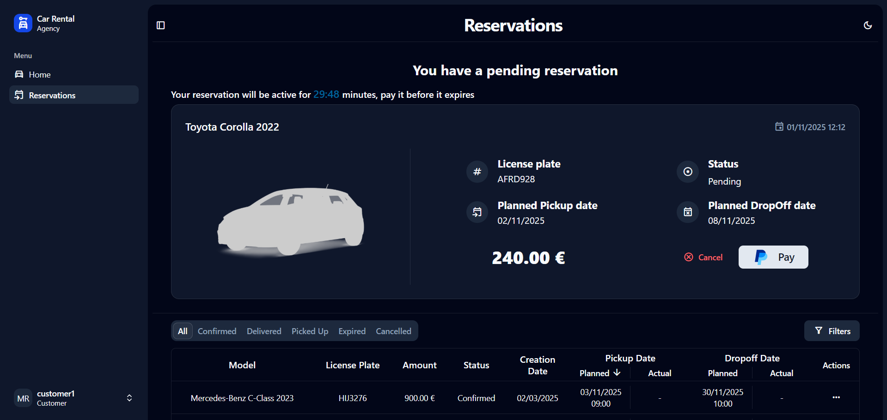
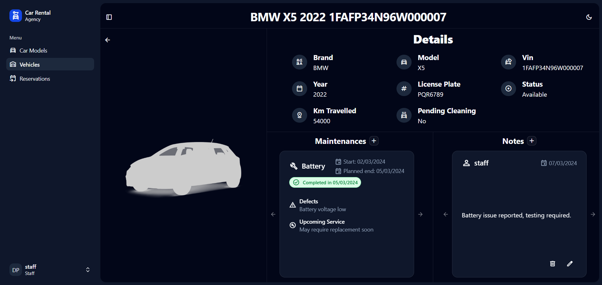
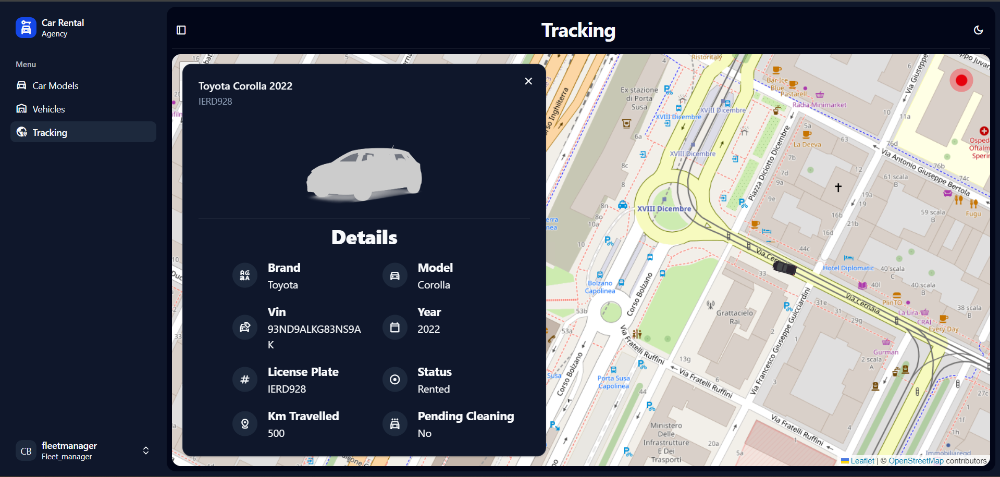
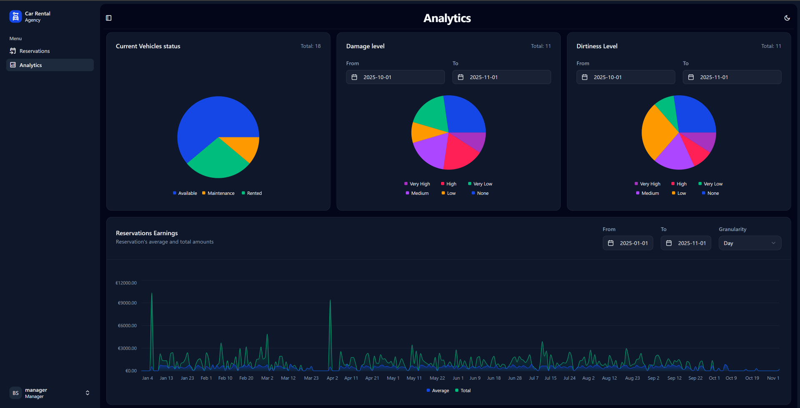

# A Microservices-based Car Rental System

Repository for the main project of the Web Applications II (2025) course at Politecnico di Torino.

[](https://react.dev/)
[](https://www.typescriptlang.org/)
[](https://leafletjs.com/)
[](https://tailwindcss.com/)
[](https://spring.io/projects/spring-boot)
[](https://kotlinlang.org/)
[](https://www.postgresql.org/)
[](https://kafka.apache.org/)
[](https://www.keycloak.org/)








## Getting started

You can run the application with the following docker command:

```bash
docker compose up
```

If you run into problems, append a `--build` flag at the end.

To remove all data and get a fresh start, execute:

```bash
docker compose down -v
```

After running the microservices, you can run the frontend with the following commands:

```bash
cd ReservationFrontend
npm install --force
npm run previewDev
```

Finally, it will be possible to access the website at the address `http://localhost:8083/ui`

## Paypal customer credentials

username: g15-personal@wa2.polito.it
password: bellapass

## Keycloak

### Export real settings

```bash
    docker exec g15-keycloak /opt/keycloak/bin/kc.sh export \
  --file /opt/keycloak/data/export/realm-export.json \
  --realm car-rental-system
```

### Account credentials

Users with role CUSTOMER

```text
username: customer1
password: password

username: customer2
password: password
```

### User with role STAFF

```text
username: staff
password: password
```

### User with role FLEET_MANAGER

```text
username: fleetmanager
password: password
```

### User with role MANAGER

```text
username: manager
password: password
```

## Map Data Preparation

Before you can run `osrm-backend`, you need to prepare the .osrm files from the .osm.pbf.
Run these three commands once inside `osrm` folder (they create files in osrm/data):

```bash
# Extract map data
docker run -t -v "${PWD}/data:/data" osrm/osrm-backend:v5.25.0 osrm-extract -p /opt/car.lua /data/turin.osm.pbf

# Partition map
docker run -t -v "${PWD}/data:/data" osrm/osrm-backend:v5.25.0 osrm-partition /data/turin.osrm

# Customize map
docker run -t -v "${PWD}/data:/data" osrm/osrm-backend:v5.25.0 osrm-customize /data/turin.osrm
```

[OSRM API](https://project-osrm.org/docs/v5.24.0/api)

